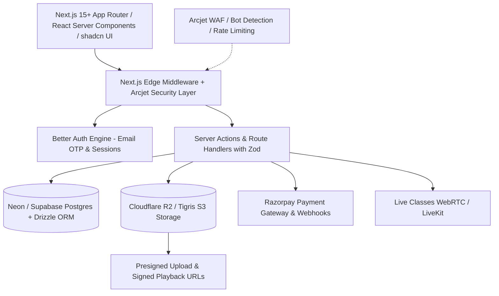
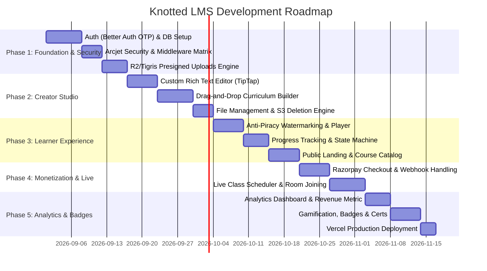
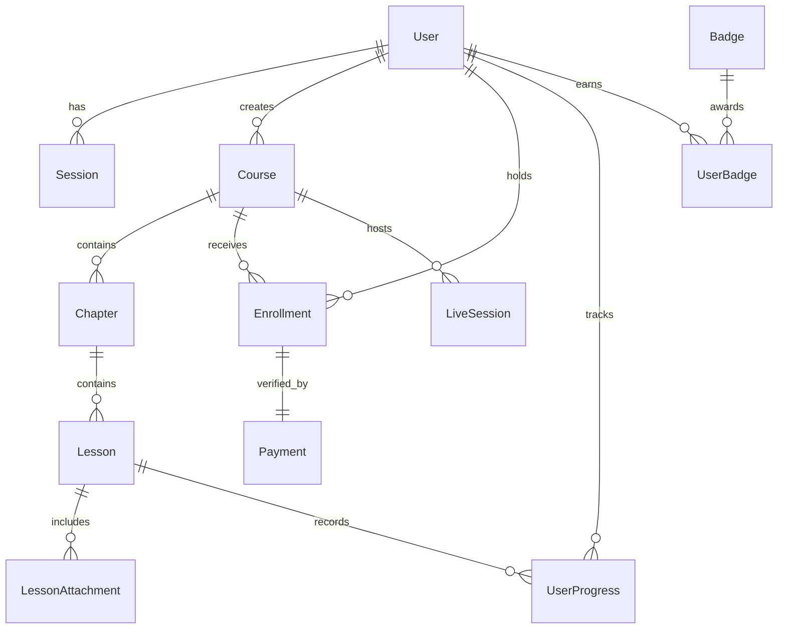

# Product Requirement Document (PRD)

# Project: **Knotted LMS**
**Document Version:** 1.0.0  
**Target Release:** Q3/Q4 2026  
**Primary Brand Aesthetic:** Forest Green & Warm Cream White (`#134E3F` / `#0D382E` & `#FBF9F4` / `#F4EFE6`)  
**Core Stack:** Next.js (App Router), Arcjet, PostgreSQL (Neon / Supabase), Cloudflare R2 / Tigris, Better Auth, Tailwind CSS, shadcn/ui, Zod, Razorpay, Vercel

---

## 1. Executive Summary & Vision

### 1.1 Product Overview
**Knotted** is an enterprise-grade, aesthetic, and creator-first Learning Management System (LMS). Inspired by the timeless concept of "tying knowledge into unbreakable knots," the platform connects educators and learners through high-engagement video courses, interactive rich-text lessons, real-time live cohort classes, robust DRM/piracy deterrence, and a rewarding gamification engine.

### 1.2 Brand Identity & Visual Language
- **Primary Aesthetics:** Natural, organic prestige. Deep forest greens, jade accents, warm cream backgrounds, and refined typography evoke calm focus and mastery.
- **Color Palette Tokens:**
  - `knotted-cream-bg`: `#FBF9F4` (Primary light canvas)
  - `knotted-cream-card`: `#F3EFE6` (Surface cards, dialogs, dropdowns)
  - `knotted-cream-border`: `#E5DED0` (Subtle dividers & borders)
  - `knotted-green-primary`: `#134E3F` (Brand anchor, primary buttons, active headers)
  - `knotted-green-deep`: `#0D382E` (Sidebar backgrounds, hero sections, dark accents)
  - `knotted-green-emerald`: `#10B981` (Success badges, progress meters, active toggles)
  - `knotted-green-mint`: `#D1FAE5` (Pills, tag backgrounds, notification highlights)
  - `knotted-gold`: `#D4AF37` / `#F59E0B` (Certificates, achievement trophies, streak badges)
  - `knotted-charcoal`: `#1F2923` (High-contrast typography)
  - `knotted-muted`: `#64746B` (Secondary text, subtitles, captions)

---

## 2. Target Personas & Use Cases

| Persona | Role | Core Goals | Frustrations Solved |
| :--- | :--- | :--- | :--- |
| **Aarav (Educator / Creator)** | Independent instructor or academy owner | Fast drag-and-drop course creation, secure video hosting, automated Razorpay payouts, student retention insights. | Complex multi-tier LMS setups, high SaaS revenue cuts, course piracy / unauthorized screen capture. |
| **Meera (Learner / Student)** | Tech professional or university student | Distraction-free video player, structured chapters, one-click live sessions, clear progress tracking, earned badges. | Cluttered interfaces, broken video playback, losing spot in lectures, lack of completion motivation. |
| **Dev / Admin (Platform Owner)** | Administrator & ops engineer | Rock-solid edge security with Arcjet, fast zero-cold-start DB on Neon/Supabase, zero-egress storage fees via Cloudflare R2 / Tigris. | Spam bots, brute-force auth attempts, massive video egress bills, difficult file uploads. |

---

## 3. Technology Stack & Infrastructure



| Layer | Technology | Purpose & Rationale |
| :--- | :--- | :--- |
| **Framework** | Next.js 15+ (App Router) | Server Components (RSC), Server Actions, Streaming SSR, Edge Middleware. |
| **Security Shield** | Arcjet | Bot detection, rate-limiting, disposable email validation, sensitive info shielding, attack protection (SQLi, XSS). |
| **Authentication** | Better Auth | Type-safe, session-based auth with passwordless Email OTP, Magic Links, role-based access control (Admin vs Student). |
| **Database** | Neon PostgreSQL / Supabase | Serverless, branching-ready relational Postgres with connection pooling. |
| **ORM / Querying** | Drizzle ORM / Prisma | End-to-end TypeScript safety, automatic migrations, lightweight runtime footprint. |
| **Object Storage** | Cloudflare R2 / Tigris Object Storage | S3-compatible, zero-egress cost storage for high-res videos, course attachments, dynamic certificates. |
| **UI & Styling** | Tailwind CSS + shadcn/ui + Radix UI | Accessible primitives, customizable cream/forest-green design system, Lucide icons. |
| **Drag & Drop** | `@hello-pangea/dnd` / `@dnd-kit/core` | Smooth curriculum reordering (chapters & lessons) with optimistic UI updates. |
| **Rich Text Editor**| TipTap / Novel Editor | Custom headless editor with block formatting, code syntax highlighting, image uploads, embeds. |
| **Validation** | Zod | Runtime contract validation for Server Actions, API routes, and Razorpay webhook payloads. |
| **Payments** | Razorpay (Checkout & Webhooks) | Direct INR / International currency checkout, automated webhook verification, atomic enrollment state machine. |
| **Deployment** | Vercel | Global edge routing, automated preview deployments, zero-config Next.js optimizations. |

---

## 4. Phase-by-Phase Implementation Roadmap



---

## 5. Detailed Feature Specifications

### 5.1 Authentication & Security (Better Auth + Arcjet)
1. **Passwordless Email OTP & Magic Link Flow:**
   - User inputs email $\rightarrow$ Arcjet checks for disposable/temporary email domains and rate limits spam attempts.
   - Better Auth generates a secure, cryptographically signed 6-digit OTP / magic link.
   - Email dispatched using Resend / Nodemailer styled with Knotted's green and cream branding.
   - Session stored in HTTP-only, secure, same-site cookies with server-side validation.
2. **Arcjet Guard Matrix:**
   - **Rate Limiting:** Max 5 OTP requests per 10 minutes per IP; max 100 API mutations per minute per authenticated user.
   - **Bot Detection:** Shield endpoints from automated headless scrapers and malicious crawlers.
   - **Shield WAF:** Detect and block suspicious payloads (SQL injection attempts, XSS payloads in rich text).

---

### 5.2 Storage, Uploads & Content Management (Cloudflare R2 / Tigris)
1. **Direct-to-Storage Presigned URLs:**
   - File uploads bypass the Next.js server to avoid serverless payload limits (4.5MB).
   - Server Action generates an S3 Presigned `PUT` URL with a 5-minute expiry, strict MIME-type validation, and size constraints (e.g., max 2GB for videos, 25MB for PDFs).
2. **Custom File Drag-and-Drop Zone:**
   - Integrated with shadcn/ui and custom chunked progress indicators.
   - Multi-file drop, automatic checksum validation, retry logic, and preview generation.
3. **Safe File Deletion:**
   - Cascading orphan cleanup: When a lesson or course is deleted, associated media in R2/Tigris is queued and deleted via an idempotent deletion worker.

---

### 5.3 Course Creation & Curriculum Builder (Drag-and-Drop)
1. **Curriculum Hierarchy:**
   - `Course` $\rightarrow$ `Chapter` (Module) $\rightarrow$ `Lesson` (Video / Text / Quiz / Live Session).
2. **Interactive DnD Builder:**
   - Built with `@hello-pangea/dnd` or `@dnd-kit`.
   - Allows reordering chapters within a course and lessons within/across chapters.
   - Optimistic UI updates with instant feedback; debounced server action syncing new sort indices (`sortOrder: Int`).
3. **Custom Rich Text Editor (TipTap / Novel):**
   - Clean block editor with cream-paper background.
   - Features: Headings, Code block with syntax highlighting, Callout boxes, Tables, Embedded Video links, Image insertion via drag-and-drop.

---

### 5.4 Video Player, Progress Tracking & Anti-Piracy Deterrence
1. **Realistic Piracy Deterrence Architecture:**
   > [!IMPORTANT]
   > Web browsers cannot prevent screen recording at an OS level. Knotted implements multi-layered deterrence to prevent casual ripping and trace bad actors:
   - **Dynamic Floating Watermark:** Canvas/DOM overlay floating across the video player displaying the active student's Email, IP Address, User ID, and rotating UTC timestamp at semi-random intervals (renders recorded copies identifiable and non-shareable).
   - **Signed Short-Lived Playback Tokens:** S3/R2 video URLs signed with a 15-minute validity; access tied strictly to active enrollment sessions.
   - **Context Menu & DevTools Deterrence:** Disabled right-click download, disabled inspection shortcut triggers on video viewport, hidden direct media sources via MSE / HLS chunking.
2. **Progress Tracking Engine:**
   - Video heartbeats sent every 10 seconds: tracks `watchedDuration`, `totalDuration`, and sets `isCompleted: true` when reaching 90% completion.
   - Auto-advance to the next lesson on completion with visual checklist progress bars.

---

### 5.5 Monetization & Enrollment (Razorpay Integration)
1. **Razorpay Checkout Lifecycle:**
   - Student clicks "Enroll Now" $\rightarrow$ Server Action checks existing enrollment $\rightarrow$ Creates Razorpay Order with specific currency & amount.
   - Frontend triggers modal Razorpay checkout with green-accent branding.
2. **Webhook & Payment Verification:**
   - `POST /api/webhooks/razorpay` verifies `x-razorpay-signature` using HMAC SHA256.
   - Idempotency guard: Webhook events logged in `WebhookLog` table to prevent duplicate enrollments on network retries.
   - Atomic database transaction: Creates `Enrollment`, issues `Invoice`, unlocks course access, dispatches welcome email.

---

### 5.6 Live Classes & Scheduling
1. **Live Session Management:**
   - Instructors can schedule live cohort sessions with start time, duration, and agenda.
   - Integrated room provider (LiveKit / 100ms / Zoom SDK or secure WebRTC room).
2. **Live Classroom UI:**
   - Built directly inside the Knotted student dashboard with live chat, raised hands, shared screen, and automatic attendance logging.

---

### 5.7 Analytics & Instructor Dashboard
1. **Key Performance Indicators (KPIs):**
   - Total Gross Revenue (INR/USD), Monthly Recurring Revenue (MRR), Total Active Learners.
   - Course Completion Rates (%) and drop-off heatmaps per chapter.
2. **Interactive Visualizations:**
   - Built with Tailwind CSS + Recharts (customized to the Knotted Forest Green / Cream palette).

---

### 5.8 Gamification & Reward Engine (Badges & Certificates)
1. **Badge Milestones:**
   - **First Knot:** Completed first lesson.
   - **Quick Learner:** Completed 5 lessons in a single day.
   - **Master Knot:** Completed 100% of a course.
   - **Live Enthusiast:** Attended 3 live sessions.
2. **Verifiable PDF Certificates:**
   - Generated dynamically on 100% course completion using `@react-pdf/renderer` with unique QR code verification link (`/verify/[certificateId]`).

---

## 6. Database Schema (PostgreSQL Entity-Relationship Model)



### 6.1 Database Models (Drizzle / Prisma Schema)

```prisma
// Core User & Auth Model
model User {
  id            String         @id @default(cuid())
  email         String         @unique
  name          String?
  image         String?
  role          UserRole       @default(STUDENT) // STUDENT, INSTRUCTOR, ADMIN
  createdAt     DateTime       @default(now())
  updatedAt     DateTime       @updatedAt
  
  sessions      Session[]
  courses       Course[]       @relation("InstructorCourses")
  enrollments   Enrollment[]
  progress      UserProgress[]
  badges        UserBadge[]
  certificates  Certificate[]
}

enum UserRole {
  STUDENT
  INSTRUCTOR
  ADMIN
}

// Course Hierarchy
model Course {
  id            String         @id @default(cuid())
  title         String
  slug          String         @unique
  description   String?        @db.Text
  thumbnailUrl  String?
  price         Decimal        @default(0.00) @db.Decimal(10, 2)
  isPublished   Boolean        @default(false)
  instructorId  String
  instructor    User           @relation("InstructorCourses", fields: [instructorId], references: [id], onDelete: Cascade)
  
  chapters      Chapter[]
  enrollments   Enrollment[]
  liveSessions  LiveSession[]
  certificates  Certificate[]
  createdAt     DateTime       @default(now())
  updatedAt     DateTime       @updatedAt
}

model Chapter {
  id          String      @id @default(cuid())
  title       String
  sortOrder   Int         @default(0)
  courseId    String
  course      Course      @relation(fields: [courseId], references: [id], onDelete: Cascade)
  lessons     Lesson[]
  createdAt   DateTime    @default(now())
  updatedAt   DateTime    @updatedAt
}

model Lesson {
  id           String             @id @default(cuid())
  title        String
  slug         String
  type         LessonType         @default(VIDEO) // VIDEO, TEXT, LIVE, QUIZ
  content      String?            @db.Text
  videoUrl     String?
  durationSec  Int                @default(0)
  sortOrder    Int                @default(0)
  isFree       Boolean            @default(false)
  chapterId    String
  chapter      Chapter            @relation(fields: [chapterId], references: [id], onDelete: Cascade)
  attachments  LessonAttachment[]
  progress     UserProgress[]
  createdAt    DateTime           @default(now())
  updatedAt    DateTime           @updatedAt
}

enum LessonType {
  VIDEO
  TEXT
  LIVE
  QUIZ
}

model LessonAttachment {
  id        String   @id @default(cuid())
  name      String
  fileUrl   String
  fileSize  Int
  lessonId  String
  lesson    Lesson   @relation(fields: [lessonId], references: [id], onDelete: Cascade)
  createdAt DateTime @default(now())
}

// Enrollment, Payments & Progress
model Enrollment {
  id        String           @id @default(cuid())
  userId    String
  courseId  String
  user      User             @relation(fields: [userId], references: [id], onDelete: Cascade)
  course    Course           @relation(fields: [courseId], references: [id], onDelete: Cascade)
  paymentId String?          @unique
  payment   Payment?         @relation(fields: [paymentId], references: [id])
  status    EnrollmentStatus @default(ACTIVE)
  createdAt DateTime         @default(now())
  
  @@unique([userId, courseId])
}

enum EnrollmentStatus {
  ACTIVE
  REVOKED
  EXPIRED
}

model Payment {
  id                String        @id @default(cuid())
  razorpayOrderId   String        @unique
  razorpayPaymentId String?       @unique
  razorpaySignature String?
  amount            Decimal       @db.Decimal(10, 2)
  currency          String        @default("INR")
  status            PaymentStatus @default(PENDING)
  enrollment        Enrollment?
  createdAt         DateTime      @default(now())
}

enum PaymentStatus {
  PENDING
  SUCCESS
  FAILED
  REFUNDED
}

model UserProgress {
  id              String   @id @default(cuid())
  userId          String
  lessonId        String
  user            User     @relation(fields: [userId], references: [id], onDelete: Cascade)
  lesson          Lesson   @relation(fields: [lessonId], references: [id], onDelete: Cascade)
  isCompleted     Boolean  @default(false)
  lastWatchedSec  Int      @default(0)
  updatedAt       DateTime @updatedAt
  
  @@unique([userId, lessonId])
}

// Gamification
model Badge {
  id          String      @id @default(cuid())
  code        String      @unique // FIRST_KNOT, MASTER_KNOT, etc.
  title       String
  description String
  iconUrl     String
  userBadges  UserBadge[]
}

model UserBadge {
  id        String   @id @default(cuid())
  userId    String
  badgeId   String
  user      User     @relation(fields: [userId], references: [id], onDelete: Cascade)
  badge     Badge    @relation(fields: [badgeId], references: [id], onDelete: Cascade)
  awardedAt DateTime @default(now())
  
  @@unique([userId, badgeId])
}

model Certificate {
  id             String   @id @default(cuid())
  certificateNo  String   @unique
  userId         String
  courseId       String
  user           User     @relation(fields: [userId], references: [id], onDelete: Cascade)
  course         Course   @relation(fields: [courseId], references: [id], onDelete: Cascade)
  pdfUrl         String
  issuedAt       DateTime @default(now())
}

model LiveSession {
  id          String    @id @default(cuid())
  courseId    String
  course      Course    @relation(fields: [courseId], references: [id], onDelete: Cascade)
  title       String
  description String?
  startTime   DateTime
  durationMin Int       @default(60)
  meetingRoom String
  isEnded     Boolean   @default(false)
  createdAt   DateTime  @default(now())
}
```

---

## 7. Middleware, Edge Routing & Arcjet Protection Matrix

```typescript
// middleware.ts - Edge Shield & Auth Routing
import arcjet, { shield, detectBot, slidingWindow } from "@arcjet/next";
import { NextResponse } from "next/server";
import type { NextRequest } from "next/server";

const aj = arcjet({
  key: process.env.ARCJET_KEY!,
  rules: [
    shield({ mode: "LIVE" }),
    detectBot({
      mode: "LIVE",
      allow: ["CATEGORY:SEARCH_ENGINE", "CATEGORY:PREVIEW"],
    }),
    slidingWindow({
      mode: "LIVE",
      interval: "1m",
      max: 100,
    }),
  ],
});

export async function middleware(req: NextRequest) {
  const decision = await aj.protect(req);
  if (decision.isDenied()) {
    return NextResponse.json({ error: "Access Denied by Security Policy" }, { status: 403 });
  }

  // Session verification & Route protection
  const sessionToken = req.cookies.get("better-auth.session_token");
  const { pathname } = req.nextUrl;

  const isAuthRoute = pathname.startsWith("/login") || pathname.startsWith("/verify-otp");
  const isProtectedRoute = pathname.startsWith("/dashboard") || pathname.startsWith("/learn") || pathname.startsWith("/admin");

  if (isProtectedRoute && !sessionToken) {
    return NextResponse.redirect(new URL("/login", req.url));
  }

  if (isAuthRoute && sessionToken) {
    return NextResponse.redirect(new URL("/dashboard", req.url));
  }

  return NextResponse.next();
}

export const config = {
  matcher: ["/((?!_next/static|_next/image|favicon.ico|api/webhooks).*)"],
};
```

---

## 8. UI/UX Design System Specifications

### 8.1 Color Palette & Theme Tokens
```css
@layer base {
  :root {
    --background: 45 40% 97%; /* #FBF9F4 warm cream */
    --foreground: 145 25% 15%; /* #1F2923 dark forest text */
    
    --card: 40 30% 93%; /* #F3EFE6 cream card */
    --card-foreground: 145 25% 15%;
    
    --primary: 165 60% 19%; /* #134E3F deep forest green */
    --primary-foreground: 45 40% 97%;
    
    --secondary: 155 15% 85%; /* #CBDAD2 soft sage */
    --secondary-foreground: 165 60% 19%;
    
    --muted: 150 10% 88%;
    --muted-foreground: 150 10% 40%;
    
    --accent: 158 64% 52%; /* #10B981 emerald highlight */
    --accent-foreground: 0 0% 100%;
    
    --destructive: 0 84% 60%;
    --destructive-foreground: 0 0% 98%;
    
    --border: 38 25% 85%; /* #E5DED0 */
    --input: 38 25% 85%;
    --ring: 165 60% 19%;
    
    --radius: 0.75rem;
  }
}
```

### 8.2 Typography & Component Principles
- **Headings Font:** Plus Jakarta Sans / Outfit (Bold, geometric, clean).
- **Body Font:** Inter / Geist Sans (Legible, crisp tracking).
- **Surface Elevation:** Subtle warm shadows (`box-shadow: 0 10px 30px -10px rgba(19, 78, 63, 0.08)`).
- **Header & Navbar:** Glassmorphism backdrop blur on creamy header with forest green logo and actions.

---

## 9. Non-Functional Requirements (NFRs)

1. **Performance:**
   - Lighthouse score $\ge$ 95 on landing and course discovery pages.
   - First Contentful Paint (FCP) $\le$ 0.9s on broadband; Largest Contentful Paint (LCP) $\le$ 1.8s.
2. **Scalability:**
   - Edge routing and serverless compute on Vercel handling 10,000+ concurrent active learners.
   - S3 direct-upload ensures zero bandwidth strain on the API layer.
3. **Reliability & Idempotency:**
   - Razorpay webhook processing guaranteed idempotent via `WebhookLog` audit table.
   - 99.9% uptime target with automated failover on Neon Postgres pooling.
4. **Data Security & Privacy:**
   - All sensitive credentials in `.env.local` managed through Vercel Environment Variables.
   - Full GDPR / Indian DPDP compliance with one-click user data export and deletion endpoints.

---

## 10. Summary Verification & Delivery Checklist

- [x] Full PRD structured into Product Goals, Architecture, User Personas, and Roadmap.
- [x] Color scheme configured to **Forest Green & Cream White** (`#134E3F` / `#FBF9F4`).
- [x] Complete Stack specified: **Next.js 15, Arcjet, Neon/Supabase Postgres, Cloudflare R2/Tigris, Better Auth, Tailwind CSS, shadcn/ui, Zod, Razorpay, Vercel**.
- [x] Detailed Drag-and-Drop Course Builder & Custom TipTap Rich-Text Editor specifications.
- [x] Multi-tier Piracy Deterrence architecture (Dynamic Watermarking, Signed short-lived URLs, DOM deterrence).
- [x] Complete Database ER Diagram and Prisma/Drizzle Schema code included.
- [x] Arcjet Next.js Middleware matrix & Edge protection rules fully defined.
- [x] Ready for project scaffolding and step-by-step implementation.
